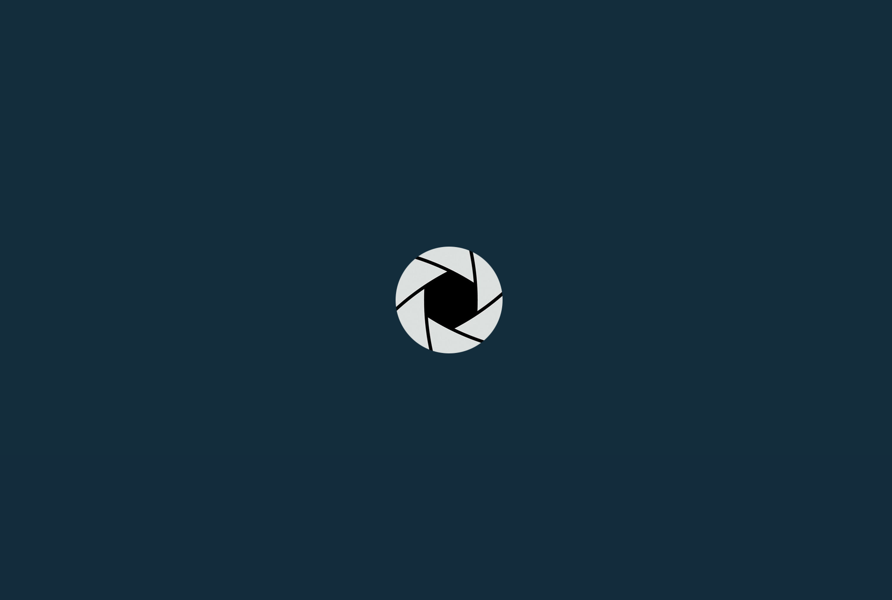
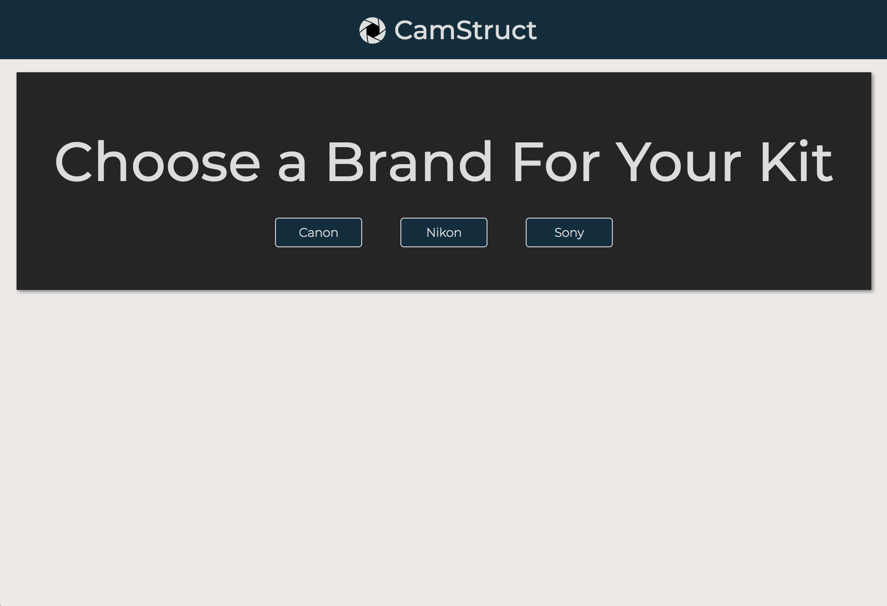
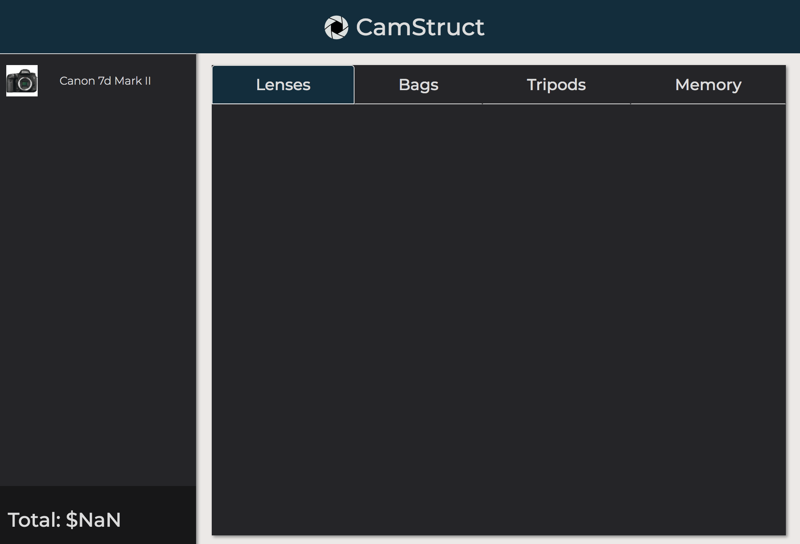

# CamStruct
*A website that can help you create a custom camera kit at a great price*






## Required
* Node
* Browser (preferably chrome) 
* Text editor

## How To Use 
1. Download zip file 
2. Enter amazon product advertising api credentials in "server.js"
```javascript
var amazon = new AmazonAPI({
  accessKeyId     : "Your access key here", 
  secretAccessKey : "Your secret access key here", 
  associateId     : "Your associate tag here",
  locale : "US"
});
```
3. Open command line and navigate to the js folder in the project
4. To run node server, use "node server.js"
5. Open index.html in browser and enjoy

## Troubleshooting
* The node server may stop sometimes due to request error, just restart the server and refresh

## Tech Used
* Node.js (https://nodejs.org/en/
* Express.js (https://expressjs.com/en/starter/installing.html)
* Handlebars.js (http://handlebarsjs.com/installation.html)
* jQuery (http://jquery.com/download/)
* jQuery UI (http://jqueryui.com/download/
* jQuery Rotate (http://jqueryrotate.com/)
* amz-products (https://www.npmjs.com/package/amz-products)
